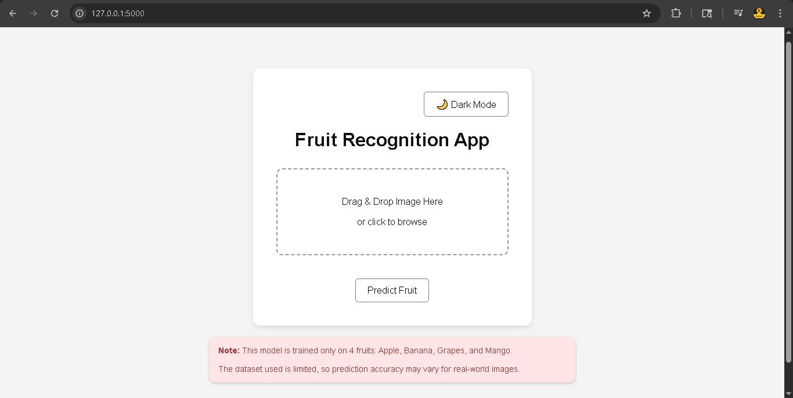
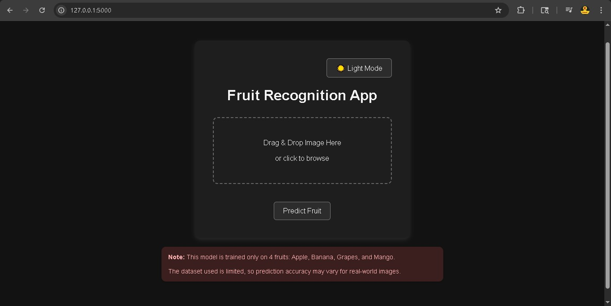
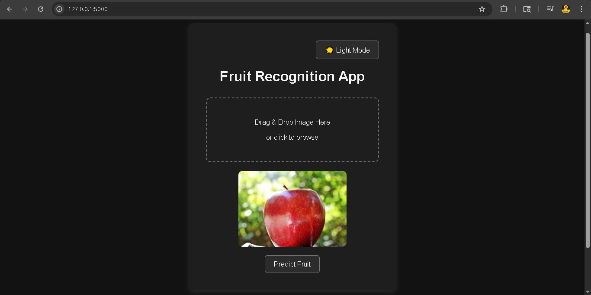
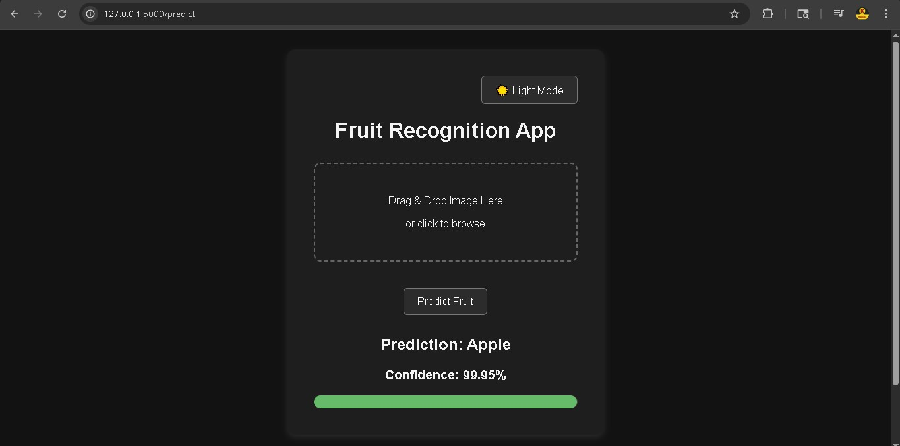

# Fruit Recognition Web App

A deep learning based fruit recognition web application built using Flask and TensorFlow.

The application allows users to upload fruit images and predicts the fruit category using a trained Convolutional Neural Network (CNN) model.

---

# 🚀 Features

- Fruit image classification using CNN
- Drag and drop image upload
- Image preview before prediction
- Confidence score with progress bar
- Dark mode / Light mode toggle
- Responsive and modern UI
- Flask backend integration
- Real-time prediction system

---

# 🛠️ Technologies Used

## Frontend
- HTML
- CSS
- JavaScript

## Backend
- Flask (Python)

## Machine Learning
- TensorFlow / Keras
- CNN (Convolutional Neural Network)

---

# 📂 Project Structure

```bash
fruit-recognition-app/
│
├── app/
│   ├── app.py
│   ├── templates/
│   │   └── index.html
│   │
│   └── static/
│       ├── style.css
│       └── script.js
│
├── training/
│   ├── model_training.ipynb
│   └── predict.py
│
├── model/
│   └── fruit_model.h5
│
├── datasets/
│   ├── train/
│   ├── validation/
│   └── test/
│
├── requirements.txt
├── README.md
└── LICENSE
```

---

# 📊 Dataset Information

Dataset used:
https://www.kaggle.com/datasets/kritikseth/fruit-and-vegetable-image-recognition

Only the following fruits were used for training:
- 🍎 Apple
- 🍌 Banana
- 🍇 Grapes
- 🥭 Mango

The dataset itself is NOT uploaded to this repository because of its large size.

---

# 🧠 Model Training

The model was trained using TensorFlow/Keras in:

```bash
training/model_training.ipynb
```

If you want to retrain the model:

1. Download the dataset from Kaggle
2. Place the dataset inside the `datasets/` folder
3. Open and run:
   ```bash
   training/model_training.ipynb
   ```

The trained model file:
```bash
model/fruit_model.h5
```

is already included in this repository.

---

# ⚙️ Installation & Setup

## 1. Clone the repository

```bash
git clone https://github.com/Kamal-Bhagchandani/fruit-recognition-app.git
cd fruit-recognition-app
```

---

## 2. Create virtual environment

```bash
python -m venv venv
```

Activate virtual environment:

### Windows
```bash
venv\Scripts\activate
```

### Linux / Mac
```bash
source venv/bin/activate
```

---

## 3. Install dependencies

```bash
pip install -r requirements.txt
```

---

# ▶️ Run the Application

Run the Flask app:

```bash
python -m app.app
```

Then open:

```text
http://127.0.0.1:5000
```

---

## 📸 Screenshots

### Light Mode



---

### Dark Mode



---

### Image Preview



---
### Prediction Result



---

# 🚀 Future Improvements

- Support for more fruit categories
- Better model accuracy
- Mobile responsive UI
- Docker support
- Cloud deployment
- Webcam based prediction

---

# 📄 License

This project is licensed under the MIT License.